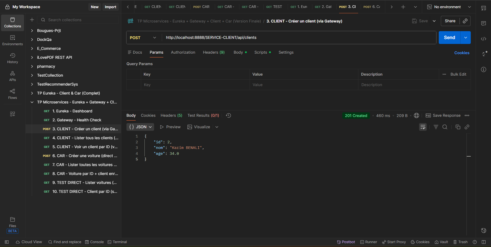
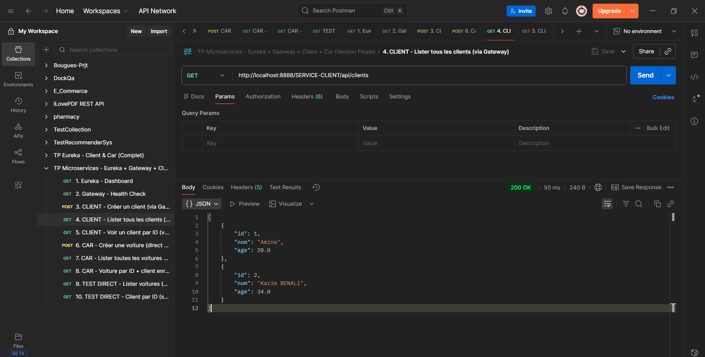
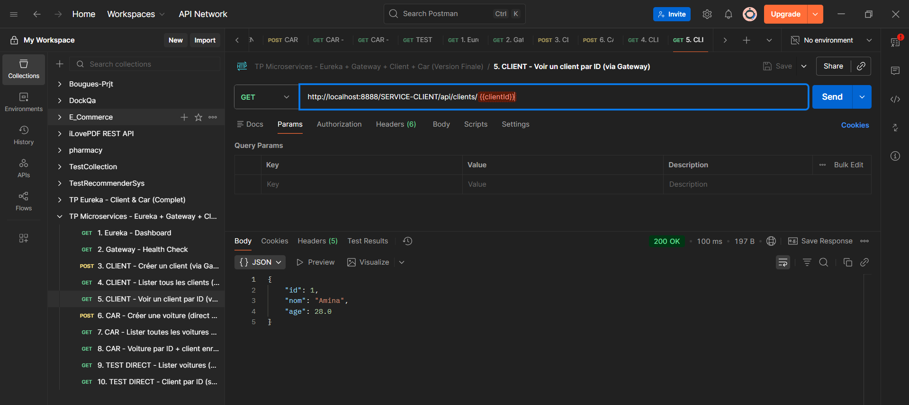
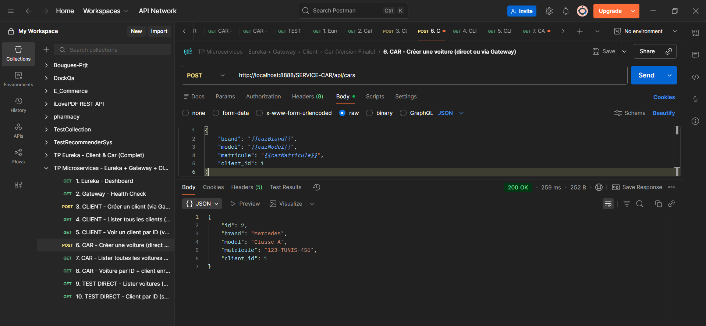
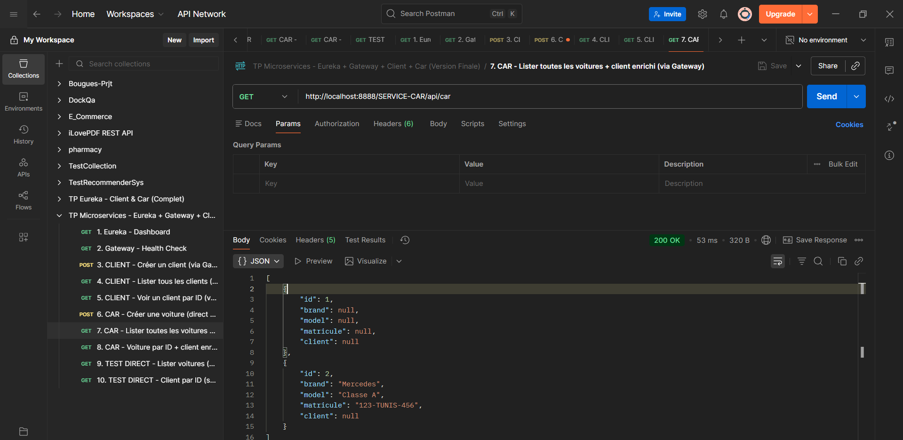

# Architecture Micro-services avec RestTemplate

Application de gestion de clients et voitures utilisant une architecture micro-services avec Spring Boot et RestTemplate.

## Architecture



**Services:**

- **Client Service** (Port 8081): Gestion des clients
- **Car Service** (Port 8082): Gestion des voitures avec enrichissement des données client
- **Gateway Service** (Port 8888): Point d'entrée unique pour tous les services

## Setup

**1. Démarrer les services dans l'ordre:**

```bash
# 1. Client Service
cd client-service
./mvnw spring-boot:run  # Port 8081

# 2. Car Service
cd car-service
./mvnw spring-boot:run  # Port 8082

# 3. Gateway
cd gateway
./mvnw spring-boot:run  # Port 8888
```

**2. Accès:**

- Gateway: `http://localhost:8888`
- Client Service: `http://localhost:8081`
- Car Service: `http://localhost:8082`

## API Endpoints

### Client Service

**Lister tous les clients:**

```bash
GET http://localhost:8888/clients
```



**Voir un client par ID:**

```bash
GET http://localhost:8888/clients/{id}
```



### Car Service

**Créer une voiture:**

```bash
POST http://localhost:8888/cars
Content-Type: application/json

{
  "brand": "Toyota",
  "model": "Corolla",
  "clientId": 1
}
```



**Lister toutes les voitures (avec client enrichi):**

```bash
GET http://localhost:8888/cars
```

_Le Car Service utilise RestTemplate pour enrichir chaque voiture avec les données du client associé._



## Technologies

- Spring Boot
- Spring Cloud Gateway
- RestTemplate
- H2 Database (in-memory)
